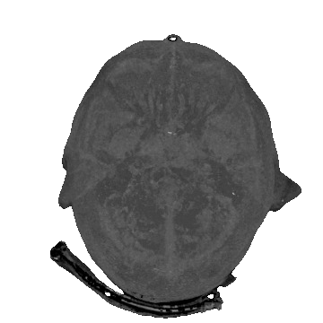

<!--- Header -->
 

  

<h3 align="center">Brain Tumor Classification Using Deep Learning (CNN)</h3>

  

    Contributors
     
    <a href="https://github.com/metehanozdeniz">Metehan Özdeniz</a>
    ·
    <a href="https://www.linkedin.com/in/abdulsamet-kuk-09455a222/">Abdulsamet Kuk</a>
      
  

## Table of Contents
* [Introdiction](#introduction)
* [Context](#context)
* [Definition](#definition)
* [Methodology](#methodology)
  * [Transfer Learning](#transfer-learning)
* [Dataset](#dataset)
* [Live Demo](#live-demo)
* [Usage](#usage)
  * [Download](#download)
  * [Install Dependencies](#install-dependencies)
  * [Execute](#execute)
* [License](#license)

## Introduction

Brain Tumors are classified as: Benign Tumor, Malignant Tumor, Pituitary Tumor, etc. Proper treatment, planning, and accurate diagnostics should be implemented to improve the life expectancy of the patients. The best technique to detect brain tumors is Magnetic Resonance Imaging (MRI). A huge amount of image data is generated through the scans. These images are examined by the radiologist. A manual examination can be error-prone due to the level of complexities involved in brain tumors and their properties.

Application of automated classification techniques using Machine Learning(ML) and Artificial Intelligence(AI)has consistently shown higher accuracy than manual classification. Hence, proposing a system performing detection and classification by using Deep Learning Algorithms using ConvolutionNeural Network (CNN), Artificial Neural Network (ANN), and TransferLearning (TL) would be helpful to doctors all around the world.

## Context

Brain Tumors are complex. There are a lot of abnormalities in the sizes and location of the brain tumor(s). This makes it really difficult for complete understanding of the nature of the tumor. Also, a professional Neurosurgeon is required for MRI analysis. Often times in developing countries the lack of skillful doctors and lack of knowledge about tumors makes it really challenging and time-consuming to generate reports from MRI’. So an automated system on Cloud can solve this problem.

## Definition

This project aimed to build a Convolutional Neural Network based deep learning model to first identify brain tumors and then classify them as Benign Tumors, Malignant Tumors or Pituitary Tumors.

## Methodology

### Transfer Learning

Transfer learning is a deep learning technique where we use a pre-defined and pre-trained neural network and train it again on the current data set. We used ResNet50 model in this project.

## Dataset
  * Dataset : [Kaggle](https://www.kaggle.com/datasets/sartajbhuvaji/brain-tumor-classification-mri)

## Live Demo

## Usage

### Download
~~~bash
git clone https://github.com/metehanozdeniz/brain-tumor.git
~~~

### Install Dependencies

~~~bash
pip install -r requirements.txt
~~~

### Execute
~~~bash
cd brain-tumor/website
python -m flask --app ./app.py run
~~~

## License

Distributed under the **MIT**. See LICENSE file for more information.

